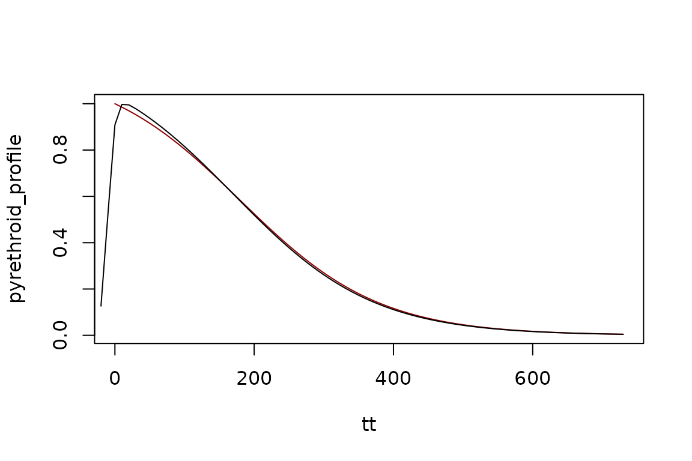
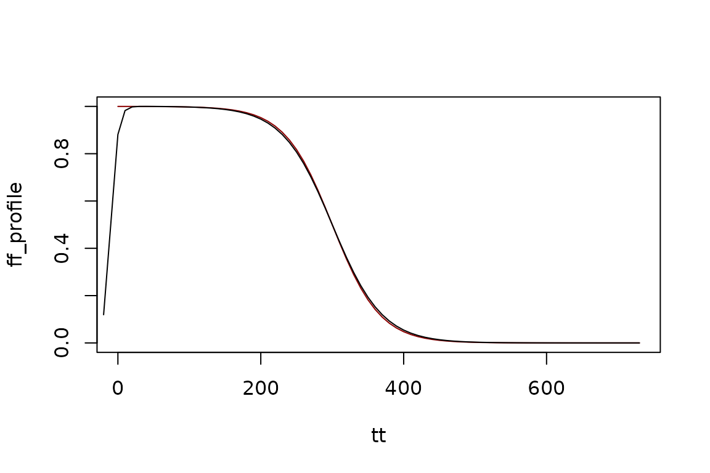
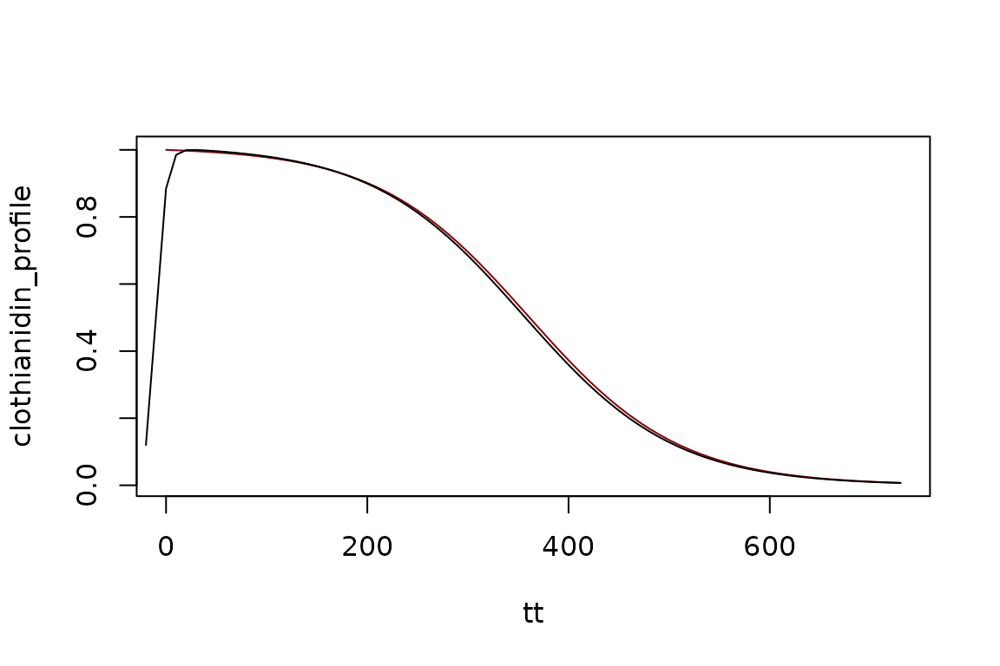

# IRS - Insecticides

``` r
library(ramp.control)
```

    ## Loading required package: ramp.xds

## Insecticides

``` r
make_profile <-  function(t, a, b, c) { 
  return((1 - a) / (1 + exp(-b * (t/30 + c))) + a)}
```

Information about waning potency is available from the manufacturers of
insecticides, so we have developed functions with preset differences
that reflect these differences.

### Pyrethroid

``` r
pyrethroid_profile <- make_profile(tt, 0, -.3, -6)
pyrethroid_profile <- pyrethroid_profile/max(pyrethroid_profile)
plot(tt+10, pyrethroid_profile, type="l", col = "darkred")

pyrethroid <- make_irs_round("pyrethroid", 10, 1)
Fa <- make_function(pyrethroid)
lines(tt1, Fa(tt1), type = "l", main="Coverage", ylab = "A Sharkfin Function", xlab = "Time")
```



### Actellic

``` r
actellic_profile <- make_profile(tt, 0, -.5, -12)
plot(tt+10, actellic_profile, type="l", col = "darkred")

actellic <- make_irs_round("actellic", 10, 1)
Fa <- make_function(actellic)
lines(tt1, Fa(tt1), type = "l", main="Coverage", ylab = "A Sharkfin Function", xlab = "Time")
```


### Bendiocarb

``` r
bendio_profile <- make_profile(tt, 0, -1.2, -3)
bendio_profile <- bendio_profile/max(bendio_profile) 
plot(tt+10, bendio_profile, type="l", col = "darkred")
bendiocarb <- make_irs_round("bendiocarb", 10, 1,  1)
Fb <- make_function(bendiocarb)
lines(tt1, Fb(tt1), type = "l", main="Coverage", ylab = "A Sharkfin Function", xlab = "Time")
```


### Fludora Fusion

``` r
ff_profile <- make_profile(tt, 0, -0.9, -10)
plot(tt+10, ff_profile, type="l", col= "darkred")
fludora_fusion <- make_irs_round("fludora_fusion", 10, 1)
Fff <- make_function(fludora_fusion)
lines(tt1, Fff(tt1), type = "l", main="Coverage", ylab = "A Sharkfin Function", xlab = "Time")
```



### Sumishield

``` r
clothianidin_profile <- make_profile(tt, 0, -.4, -12)
clothianidin_profile <- clothianidin_profile/max(clothianidin_profile)
plot(tt+10, clothianidin_profile, type="l", col = "darkred")
sumishield <- make_irs_round("sumishield", 10, 1)
Fs <- make_function(sumishield)
lines(tt1, Fs(tt1), type = "l", main="Coverage", ylab = "A Sharkfin Function", xlab = "Time")
```


